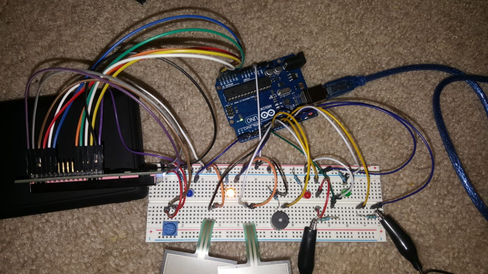
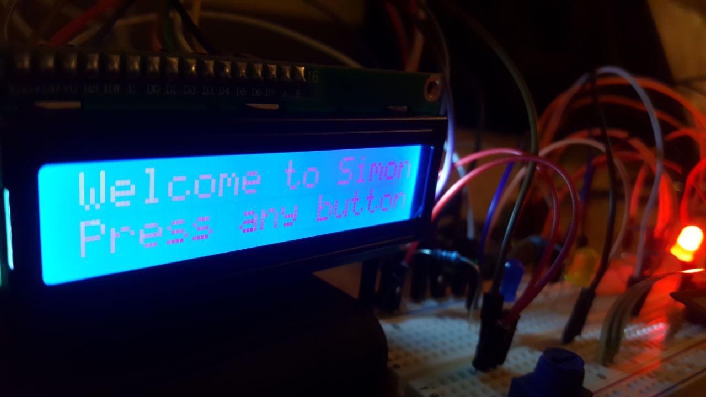
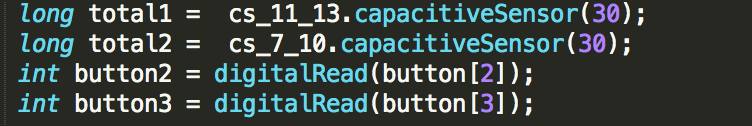
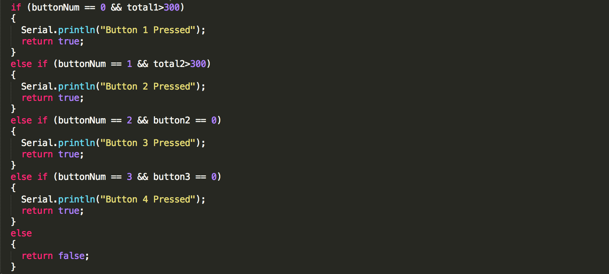
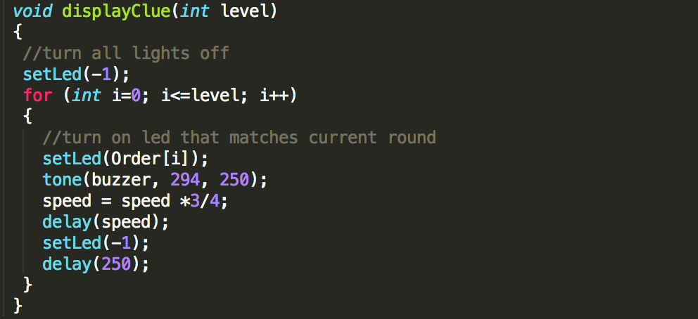
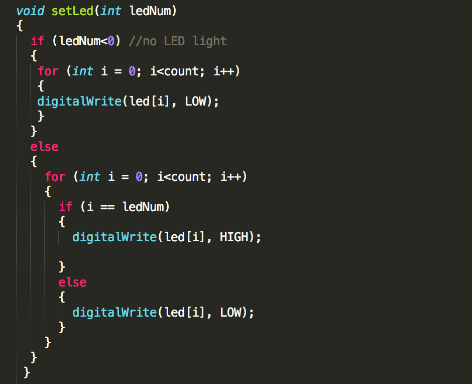

# Simon Game with Arduino Uno

## Introduction:
* The following project recreates a simon game using arduino uno. Below are the instructions on how to create the game. The game follows the below basic requirements:  
  *  **Start Method** - The game doesnt start automatically, intitally the game is in standby mode and starts only after a button is pressed.  
  * **A victory/failure method** - Game has separate state for Win and Lose situation. 
  * **LCD display** - LCD is used to display various status of the game like Welcome Message, Game Message, Victory/Failure Message.  
  * **Piezo buzzer** to set up distictive tones for each LED and various tones for start, win and lose situation.  
* Apart from the basic setup, I have added 2 additional features: 
  *  Added a `speed` feature to speed up the game after every level.  
  *  Used `capacitive sensor` library to use conductive fabric as a touch input instead of regular buttons. 

## Components:
* 1 Arduino UNO  
* 1 Breadboard  
* 4 LED's  
* 1 Buzzer  
* 2 Force Sensitive resistors.
* 2 Conductive fabric
* 1  LCD 16x2 Output Screen  
* 5 Resistors  
* Jumper cables  
* 4 Analog Force Sensitive resistors   
* Potentiometer  

## Fritzing Diagram:

## Project look:

## How it Works:
* Once you have made the connections according to the fritzing diagram and uploaded the code into the arduino UNO, the game starts: 
* The code divides the game into 4 segments: 
  * state 1 = Standby. 
  * state 2 = Play Game. 
  * state 3 = win. 
  * state 4 = lose. 

## State 1: Standby Mode 
* Initially the game is in standby mode, the LED's turn on and off in sequence until a button is pressed.  
* An `If` condition is used to check whether any button is pressed. The game continues to be on standby till this returns false.  
* Button 1 and 2 are connected to conductive fabric by using `capacitive sensor` library. 
* Button 3 and 4 are connected to force sensitive resistors.  

* a `waitForInput` function is called which checks if any button was pressed. 

* Once any button is pressed the game goes into state 2.  
## State 2 : Game Mode 
* `playGame();` function is called which uses floor to round number down to nearest integer and random to choose random numbers from 0 to 4 to put in the `Order` array. 
* the `displayClue` function turns on led using the `setLed` function. 

* `waitForInput(Order[i]` checks if the correct buttons are pressed. If yes `level++` increases the size of next pattern and `speed` is reduced by 3/4th to make the next level go faster. 
* If all 5 levels have been cleared then the control goes to state 3 to win mode. 
* If at any point of the game an incorrect button is pressed the control goes to state 4 to lose mode.  
## State 3: Win Mode 
* Once all 5 levels are cleared the games goes to state 3 displaying the winning message. 
* `winning_sound();` function plays the winning tone using peizo buzzer. 
* `winDisplay();` function makes the LED's light up sequentially 
* `lcd.print` displays "You Win" on the LCD screen. 
* The code goes back to state 1. 
* `speed` is reverted back to 500.  

## State 4: Lose Mode 
* If the button pressed does not match the pattern of the LED's, the control goes to state 4. 
* `losing_sound();` function plays the losing tone using peizo buzzer.  
* `loseDisplay();` function makes the all LED's light up 4 times.  
* `lcd.print` displays "You Lose" on the LCD screen.  
* The code goes back to state 1. 
* `speed` is reverted back to 500.  

---
## Sources:
1. LCD connection: https://www.youtube.com/watch?v=dZZynJLmTn8  
2. State syntax: https://create.arduino.cc/projecthub/43680/breadboard-to-pcb-part-1-making-the-simon-says-game-4a3e8a  
3. Capacitive sensor and conductive fabric: https://learn.adafruit.com/capacitive-touch-with-conductive-fabric-and-flora/code  

